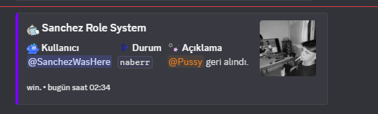

<p align="center">
  
</p>

# 💠 Noran-Durum-Rol

> Kullanıcıların Discord profil durumlarına göre **otomatik rol** veren ve yöneten gelişmiş sistem.  
> ⚙️ Geliştirildi: **SanchezWasHere?** | 🤖 Destek: **ChatGPT AI** ile

---

## ⚠️ Etik Uyarı
Bu proje açık kaynak olarak paylaşılmıştır ancak birebir kopyalanıp "**ben yaptım**" denmesi **etik değildir**.  
Lütfen emeğe saygı gösterin.

---

## 🚀 Özellikler

- 🔍 Discord durumunda belirli yazı varsa otomatik rol verme
- ❌ Yazı kaldırıldığında rolün geri alınması
- 🧾 Embed destekli log sistemi
- 🛠️ Komutlarla ayarlanabilir sistem: yazı, rol ve log kanalı
- 🎛️ Modern, butonlu ve kategorize edilmiş yardım menüsü
- 🧠 Offline kullanıcıları dikkate alan akıllı kontrol
- 📊 Durumda yazıyı kullananları listeleme

---

## 🧩 Kurulum

```bash
npm install
```

`.env` dosyasına bot tokeninizi ekleyin:
```
BOT_TOKEN=your_bot_token_here
```

Botu başlatın:
```bash
npm start
```

---

## 💬 Komutlar

| Komut                  | Açıklama |
|------------------------|----------|
| `/setup`               | Sistemi tek komutla kurar |
| `/rol-ayarla @rol`     | Durumu yapanlara verilecek rolü ayarlar |
| `/durum-log #kanal`    | Log embedlerinin gönderileceği kanalı ayarlar |
| `/yazi-ayarla [yazı]`  | Takip edilecek durumu belirler |
| `/yardım`              | Yardım menüsünü gösterir |
| `📋 Durum Yapanlar`     | (Yardım menüsündeki butonla) aktif kullanıcıları listeler |

---

## 📦 Gereksinimler

- Node.js `v16.9.0` veya üzeri
- Discord.js `v14`
- Aşağıdaki Discord intent izinleri:
  - Presence Intent
  - Guild Members
  - Guild Presences
  - Guilds
  - Guild Messages

---

## 📄 Lisans

Bu proje [MIT Lisansı](LICENSE) ile lisanslanmıştır.

---

## 🧠 Not

Bu proje **ChatGPT ve diğer yapay zeka araçlarının** katkısıyla geliştirilmiştir.  
Geliştirici imzası: `SanchezWasHere?`

---
